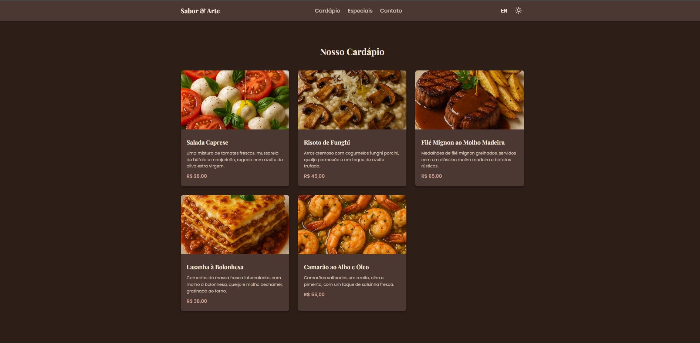
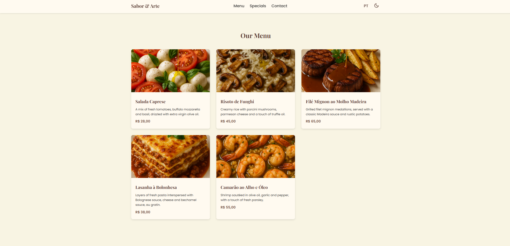

# ✨ Sabor & Arte: Restaurante Digital ✨

### 🍽️ Experiência Culinária e Design em Sintonia

Um projeto moderno e elegante que simula a presença digital de um restaurante, combinando um design responsivo com funcionalidades interativas e acessíveis.

## 🖥️ Demonstração Visual

Explore a versatilidade do tema com uma prévia da interface nos modos claro e escuro.





## 🌟 Funcionalidades em Destaque

-   **Alternância de Tema (Modo Claro/Escuro):** Personalize sua navegação! O site se adapta ao seu gosto, e sua preferência de tema é salva automaticamente.
-   **Suporte a Múltiplos Idiomas (i18n):** Tradução instantânea entre Português e Inglês, garantindo acessibilidade a um público global.
-   **Cardápio Dinâmico e Interativo:** Navegue pelo cardápio com um design de grid atraente. Clique para ver os detalhes completos de cada prato em um modal elegante.
-   **Carrossel de Especiais:** Uma galeria de imagens para seduzir os visitantes com os pratos mais especiais da casa.
-   **Formulário de Reserva Inteligente:** Faça sua reserva de forma prática, com um formulário que valida os dados em tempo real e notifica o sucesso do envio.
-   **Navegação Aprimorada:** O botão "Voltar ao Topo" facilita a movimentação em páginas longas, proporcionando uma navegação mais fluida.
-   **Design Responsivo:** Uma experiência impecável em qualquer dispositivo, do desktop ao smartphone.

## 💻 Tecnologias Utilizadas

Este projeto é 100% **Front-end**, construído com as seguintes tecnologias, sem a necessidade de dependências ou back-end:

-   **HTML5:** Estrutura semântica para uma base sólida e acessível.
-   **CSS3:** Estilização moderna com **CSS Variables** para o sistema de temas, e **Flexbox** e **Grid** para o layout responsivo.
-   **JavaScript (ES6+):** A alma interativa do projeto, responsável por todas as funcionalidades dinâmicas.
-   **Fontes e Ícones:** Utilização do Google Fonts (`Playfair Display`, `Poppins`) e ícones em **SVG** para um design de alta qualidade e leveza.

## 🚀 Como Executar o Projeto

1.  **Clone o repositório:**
    ```bash
    git clone [https://github.com/VitorPaiola/seu-repositorio.git](https://github.com/VitorPaiola/seu-repositorio.git)
    ```
2.  **Navegue até a pasta do projeto:**
    ```bash
    cd seu-repositorio
    ```
3.  **Abra o arquivo `index.html`:**
    Simplesmente arraste o arquivo `index.html` para o seu navegador ou use a extensão "Live Server" do VS Code.

## 📁 Estrutura do Projeto

```estrutura
├── images/
│   ├── arroz-cremoso.png
│   ├── camarao.png
│   ├── lasanha.png
│   ├── medalhoes.png
│   └── salada.png
├── index.html
├── script.js
└── styles.css
```

---

## 📜 Licença

Este projeto é de código aberto e está licenciado sob os termos da [Licença MIT](https://opensource.org/licenses/MIT). Sinta-se à vontade para usar e adaptar o código conforme necessário.

## 🤝 Contribuições

Contribuições são sempre bem-vindas! Se você tem sugestões de melhorias ou encontrou algum problema, sinta-se à vontade para:
1.  Fazer um **Fork** do projeto.
2.  Criar uma nova **Branch** (`git checkout -b feature/SuaSugestao`).
3.  Fazer suas alterações e **Commitar** (`git commit -m 'feat: Adiciona sua sugestao'`).
4.  Subir para a sua branch (`git push origin feature/SuaSugestao`).
5.  Abrir um **Pull Request**.

Estou ansioso para ver suas melhorias! 😃

---

<p align="center">Feito com ❤️ por <a href="https://github.com/VitorPaiola">Vitor Paiola</a></p>
